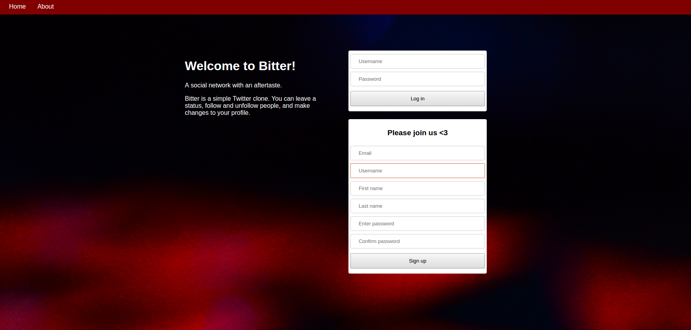
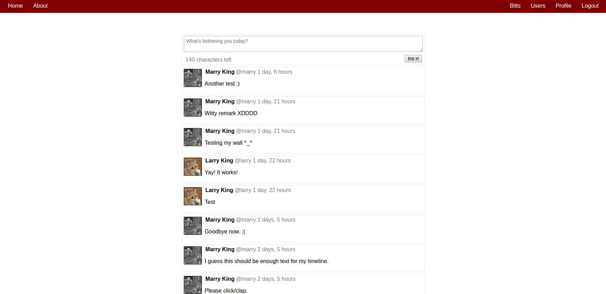
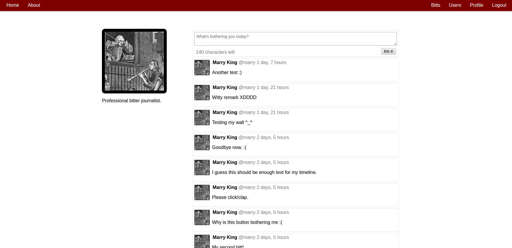
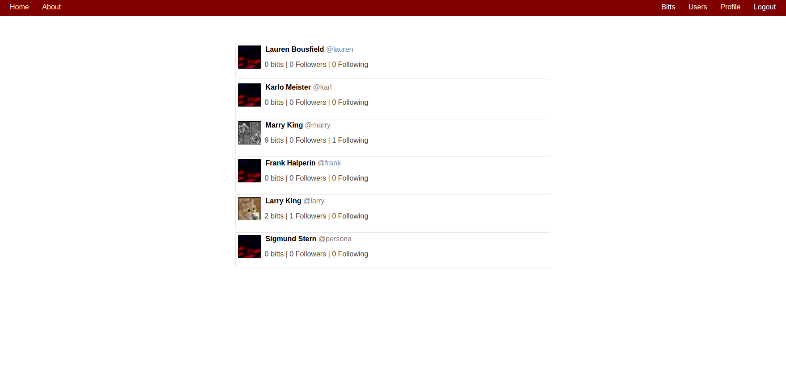

# What is Bitter?

Bitter is a very simple Twitter clone app, that I have made as an exercise to get familiar with Django platform. The app is deployed on heroku, you can interact with it using [this](https://boiling-harbor-86978.herokuapp.com/) link.

## What does it do?

It is limited in scope and features. It's features include:

* Leave a status (called bitt)
* Follow or unfollow another user
* Make changes to your profile
* Upload custom avatar
* View timeline of own bitts, other users' timeline, or joint timeline of yours and your firends bitts

## How does it look like?

Here are some screenshots:

